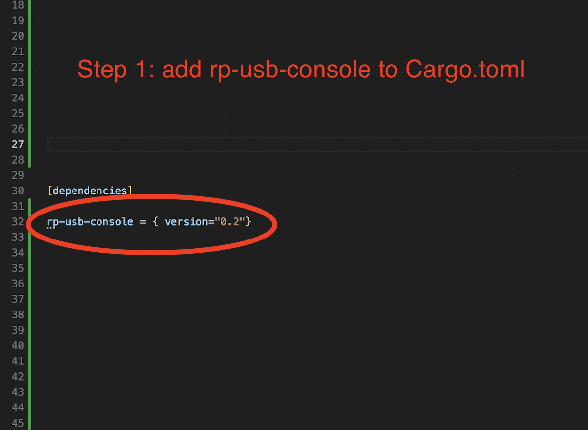

# rp-usb-console

When developing for the Raspberry Pi Pico, you typically have two choices: debugging with a hardware probe or deploying programs directly via USB. The latter is quick and convenient, but it doesn’t allow runtime communication with your application. Embassy’s built-in usb-logger lets you stream logs over USB, yet it lacks a way to send commands back (such as rebooting into BOOTSEL mode). rp-usb-console fills this gap by providing a lightweight, zero-heap solution for both logging and command exchange over USB, designed specifically for the RP2040 and the Embassy async framework. Initially, I created this library for my own use.

## Quick start



## Command list

- `/LT`: set global loglevel to TRACE
- `/LD`: set global loglevel to DEBUG
- `/LI`: set global loglevel to INFO
- `/LW`: set global loglevel to WARN
- `/LE`: set global loglevel to ERROR
- `/LO`: set global loglevel to OFF
- `/LM <module_filter>,<Loglevel>`: Set specific loglevel for modules containing module filter
- `/BS`: Reboot Pico to Boot Select (to deploy applications)
- `/RS`: Reset Pico

All command must be ended with `/r` or `/n` or both.

## Features

- **Zero-heap logging**: Fixed-size 255-byte log message buffers with no dynamic allocation
- **USB CDC ACM interface**: Standard USB serial communication
- **Non-blocking operation**: Log messages are dropped if the channel is full to maintain real-time behavior
- **Packet fragmentation**: Large messages are split into 64-byte USB packets for reliable transmission
- **Bidirectional communication**: Both logging output and line-buffered command input over USB
- **Configurable command sink**: Forward commands to your own channel or disable forwarding entirely
- **Embassy integration**: Designed specifically for Embassy executor and RP2040

## Design Goals

- **Predictable real-time behavior**: No blocking on full channels
- **Memory efficiency**: Fixed buffers, no heap allocation
- **Reliability**: Fragmented transmission reduces host latency issues
- **Safety**: Single-core RP2040 assumptions with proper synchronization

## Usage

Run `cargo add rp-usb-console --features=rp2040` to add this crate to your Pico project.

Run `cargo add rp-usb-console --features=rp235xa` to add this crate to your Pico **2** project.

Basic usage example:

```rust
use embassy_executor::Spawner;
use embassy_sync::channel::Channel;
use embassy_sync::blocking_mutex::raw::CriticalSectionRawMutex;
use log::info;

use rp_usb_console::USB_READ_BUFFER_SIZE;

// Create a channel for receiving commands from USB
static COMMAND_CHANNEL: Channel<CriticalSectionRawMutex, [u8; USB_READ_BUFFER_SIZE], 4> = Channel::new();

#[embassy_executor::main]
async fn main(spawner: Spawner) {
    let p = embassy_rp::init(Default::default());
    
    // Initialize USB logging with Info level
    rp_usb_console::start(
        spawner,
        log::LevelFilter::Info,
        p.USB,
        Some(COMMAND_CHANNEL.sender()),
    );
    
    // Now you can use standard log macros
    info!("Hello over USB!");
    
    // Handle incoming commands in a separate task
    spawner.spawn(command_handler()).unwrap();
}

#[embassy_executor::task]
async fn command_handler() {
    let receiver = COMMAND_CHANNEL.receiver();
    loop {
    let command = receiver.receive().await;
    // Process received command data (terminated by CR/LF; trailing zeros may be present)
    info!("Received command: {:?}", command);
    }
}
```

## API Reference

### `start()`

Initialize the USB CDC interface and spawn necessary tasks.

```rust
pub fn start(
    spawner: Spawner, 
    level: LevelFilter, 
    usb_peripheral: Peri<'static, USB>, 
    command_sender: Option<Sender<'static, CriticalSectionRawMutex, [u8; USB_READ_BUFFER_SIZE], 4>>
)
```

**Parameters:**

- `spawner`: Embassy task spawner
- `level`: Log level filter (e.g., `LevelFilter::Info`)
- `usb_peripheral`: RP2040 USB peripheral
- `command_sender`: Optional channel sender for receiving line-buffered USB commands (`None` disables forwarding)

### `LogMessage`

Fixed-size message buffer with USB packet fragmentation support.

- **Size**: 255 bytes maximum
- **Truncation**: Messages exceeding capacity are truncated with ellipsis
- **Fragmentation**: Automatically split into 64-byte USB packets

This crate installs with `log` feature enabled by default. In case you don't want the log output on your console (because you use `defmt` or other ways of logging) set `default-features = false` in your `Config.toml` and use `start()` without the `level` parameter.

## Implementation Details

### Memory Management

- **No heap allocation**: All buffers are statically allocated
- **Fixed message size**: 255 bytes per log message
- **Channel capacity**: 4 pending log messages maximum

### USB Protocol

- **Packet size**: 64 bytes per USB transfer
- **Fragmentation**: Large messages split across multiple packets
- **Connection handling**: Automatic reconnection support

### Threading Model

- **Single-core**: Designed for RP2040's single-core architecture
- **Embassy tasks**: Three main tasks handle USB device, TX, and RX operations
- **Non-blocking**: Log operations never block the caller

## Limitations

- Messages longer than 255 bytes are truncated
- Full log channels result in dropped messages
- Currently uses CRLF line endings
- No built-in timestamp support

## Future Improvements

- Backpressure metrics (dropped message counter)
- Configurable line ending options (CRLF/LF)
- Optional timestamp formatting
- Extended formatting features

## License

This project is licensed under the MIT License - see the [LICENSE](LICENSE) file for details.

## Contributing

Contributions are welcome! Please feel free to submit a Pull Request.
